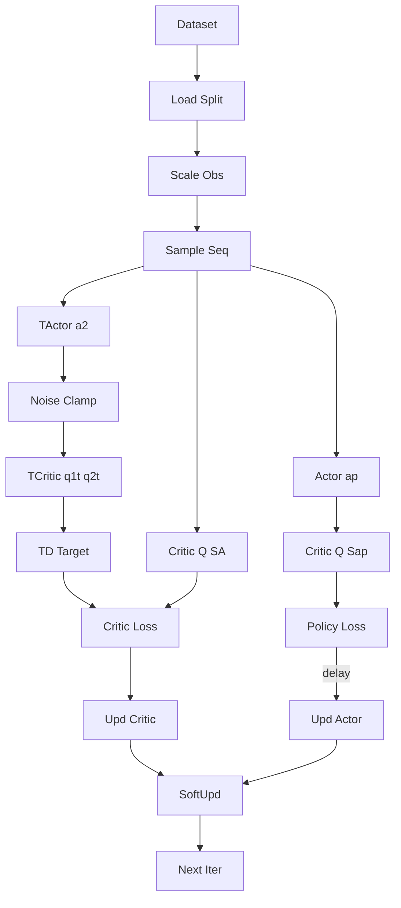
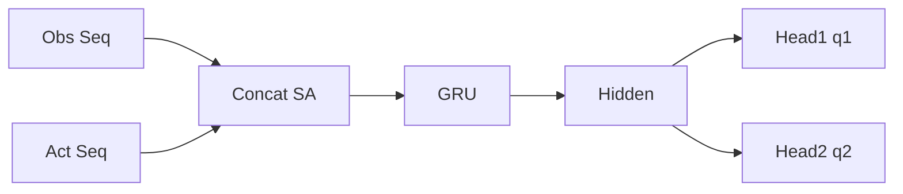
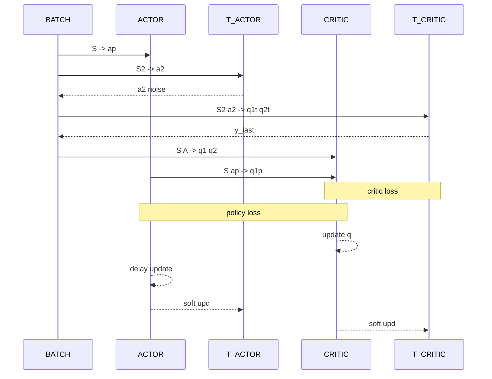

## TD3 序列决策训练架构

下面使用 Mermaid 在 Markdown 中直接展示各组件关系：

### 1. 训练主流程 (进一步精简避免解析错误)


说明：
- 采样得到长度 T 的序列 (B,T,*)，仅最后一帧参与 TD / policy 回传。
- 目标网络构造 TD 目标；策略网络延迟更新降低方差。

### 2. Actor (GRU 策略网络)


特性：只输入标准化后的 obs；输出每个时间步动作，推理时可只取最后一帧。

### 3. 双 Critic (共享结构, 独立参数)


### 4. TD3 更新关系（只示意关键交互）


### 5. 关键张量形状
| 名称 | 形状 | 说明 |
| ---- | ---- | ---- |
| S | (B,T,obs_dim) | 标准化观测序列 |
| A | (B,T,act_dim) | 动作序列 |
| a_pi | (B,T,act_dim) | 策略网络输出 |
| q1,q2 | (B,T) | 双 Q 值（逐时间步）|
| y_last | (B,) | TD 目标（仅末帧）|

### 6. 伪代码摘要
```python
# 采样 batch 序列
S, A, R, D, S2 = replay.sample(batch_size, seq_len)
with torch.no_grad():
    a2 = target_actor(S2)[:, -1]  # 可取最后一帧
    a2 = clamp(a2 + noise, -1, 1)
    q1_t, q2_t = target_critic(S2, a2)
    y_last = R_last + gamma * (1 - D_last) * torch.min(q1_t_last, q2_t_last)

q1, q2 = critic(S, A)
critic_loss = mse(q1_last, y_last) + mse(q2_last, y_last)

if step % policy_delay == 0:
    a_pi = actor(S)
    q1_pi, _ = critic(S, a_pi, only_q1=True)
    policy_loss = -q1_pi_last.mean()
    # 反向 & 更新 actor

# 软更新
soft_update(target_actor, actor, tau)
soft_update(target_critic, critic, tau)
```

> 若需要导出为图片，可把每段 ```mermaid 内代码复制到 .mmd 文件，再用 mermaid-cli 渲染。
